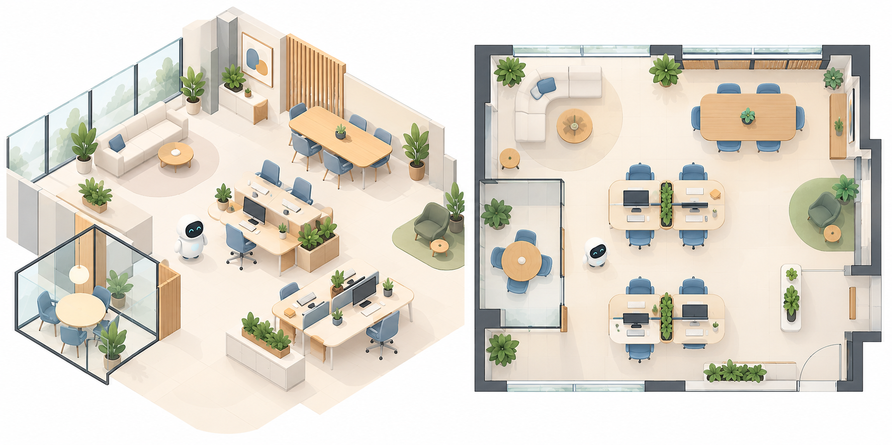
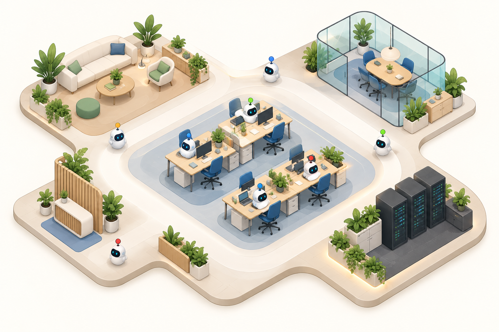
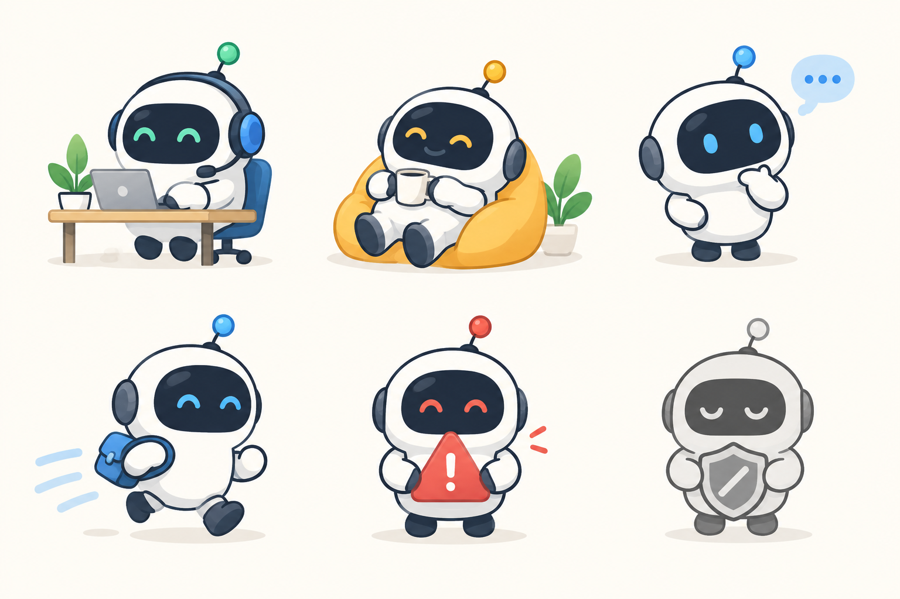
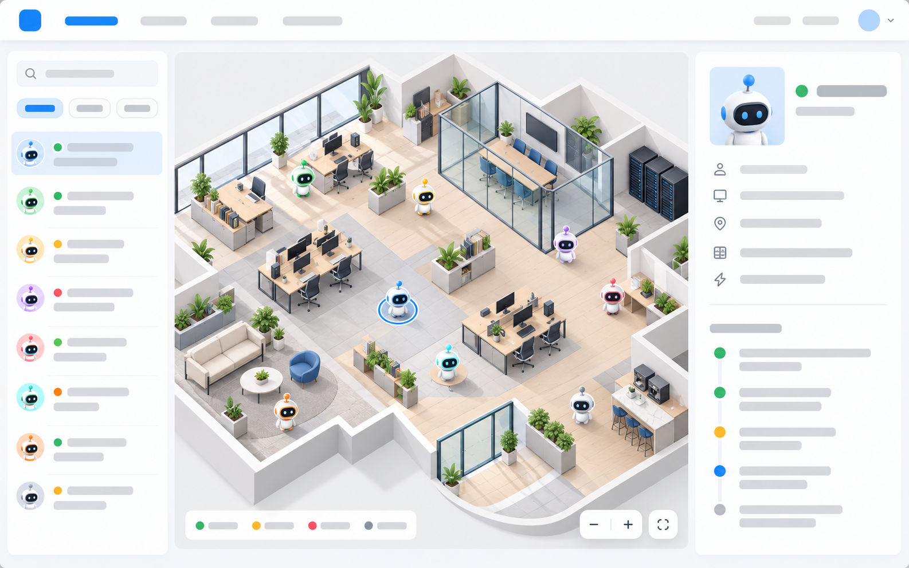
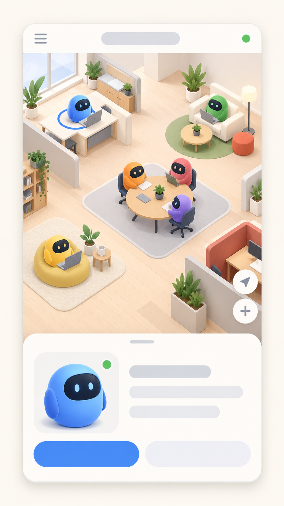
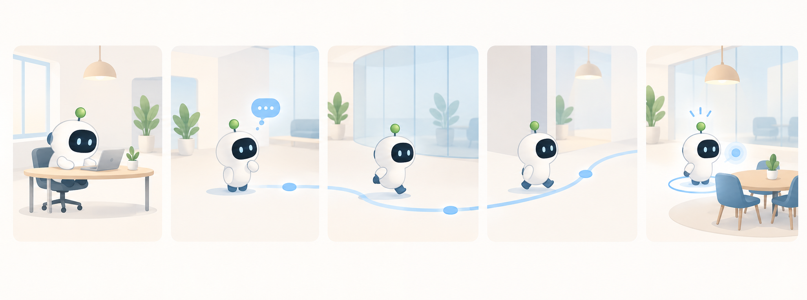
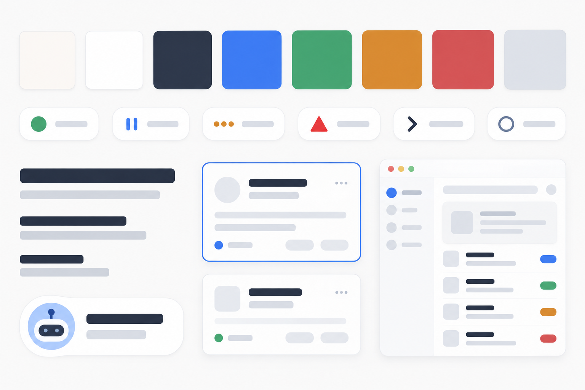

# Virtual Office — Visual Concepts

These are direction-setting references, not final production assets. They translate the recommendations in [the visual UI direction brief](../VISUAL_UI_DIRECTION.md) into a consistent visual system.

## Step 4 layout review

Open [the Step 4 wireframes](./step-4-wireframes.html) in a browser to review the annotated desktop and 360 px phone layouts for Office, analyst profile, Reports, and report detail. The companion [token file](./step-4-tokens.css) records the colors, type scale, spacing, shape, focus, and motion values shown in the wireframes.

## Step 5 production asset contract

The visual direction is now expressed as a bot-free rendered environment plus reusable transparent raster analyst poses rather than embedded concept art. See [the asset contract](../docs/ASSET_CONTRACT.md) for the four analysts, desks, role distinctions, pose keys, anchors, and export rules. Open the [asset review page](../frontend/public/assets/office/index.html) directly, or run the local frontend and open `/assets/office/index.html`, to review all twenty rendered poses and four desks at browser scale.

## 1. Art direction comparison

Recommended: the shallow, soft 2D isometric approach on the left. The overhead workspace map on the right is the simpler alternate.

## 2. Office layout

One clear floor connects lounge, work desks, meeting nook, reception, and server area with wide movement paths.

## 3. Avatar states

The shared rounded bot shape remains recognizable while state, role details, and status cues make each avatar distinct.

## Paz idle concept review

The [Paz avatar design and replacement guide](PAZ_AVATAR_DESIGN_AND_REPLACEMENT_GUIDE.md) records the completed staged replacement. The [Paz avatar review](paz-avatar-preview.html) shows the transparent idle master, the approved pose family, and the matched comparisons beside production Rex and the former portfolio avatar.

## Maul design and replacement handoff

The [Maul design guide](MAUL_AVATAR_DESIGN_GUIDE.md) and [Clara → Maul replacement plan](../docs/MAUL_AVATAR_REPLACEMENT_PLAN.md) specify the third research avatar's photo-to-style translation and later complete display-name migration. Open the [Maul visual reference board](maul-avatar-preview.html) in a browser, or view its [saved PNG](maul-design-reference-board.png), to see the supplied photo beside production Rex, Paz, and the current research avatar. The original input is preserved as [maul-photo-reference.jpeg](maul-photo-reference.jpeg). Image generation rejected the first idle request; no actual Maul candidate or runtime replacement is claimed.

## 4. Desktop UI

The desktop product view keeps the office canvas central, with search and filters on the left and selected-bot details on the right.

## 5. Mobile UI

Mobile favors a full-screen office canvas and a touch-friendly bottom sheet for the selected bot.

## 6. Motion storyboard

The movement reference shows a restrained sequence: working, thinking, moving along a clear path, then arriving selected at a destination.

## 7. Visual clarity system

This establishes the color hierarchy, status shapes, selected states, readable cards, and generous whitespace for the app.

## Direction to carry forward

- Keep the office shallow-isometric, light, and uncluttered.
- Use blue as the interaction color; reserve green, amber, red, and gray for status.
- Make the rounded bot style compact enough for dense scenes.
- Treat every status color as a color-plus-shape or motion cue.
- Build around one clear office canvas that scales down to a mobile bottom-sheet pattern.

## Wolffe design and replacement handoff

The [Wolffe design and replacement guide](WOLFFE_AVATAR_DESIGN_AND_REPLACEMENT_GUIDE.md) records the approved photo-to-style translation and completed pose-family replacement for the stable `risk` slot. Open the [Wolffe visual reference board](wolffe-avatar-preview.html) to see the supplied photo, production peers, five poses, light/dark checks, and actual CSS-size samples. The unchanged input photo is preserved as [wolffe-photo-reference.jpeg](wolffe-photo-reference.jpeg).
