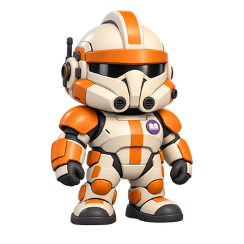

# Wolffe avatar design and replacement guide

Status: **implemented**, 8 October 2026. The supplied photo is preserved, the idle design was approved, all five pose masters were derived and normalized, the ten `risk-bot` runtime files were replaced, and current demo/live presentation labels now use Wolffe. Stable IDs, linked records, and external configuration were not recreated or dispatched.

## 1. Intended result and scope

The fourth analyst's current Theo name and robot figure are replaced with **Wolffe**, based on the user's supplied image. Wolffe belongs to the existing Rex/Paz/Cody avatar family in proportions, rendered volume, camera, lighting, materials, pose vocabulary, and apparent scale. The character change covers the complete five-pose family and every active display-name surface.

The target is the existing **`risk`** analyst, not an array position or a new agent. Keep exactly four identities: Rex/`market`, Paz/`portfolio`, Cody/`research`, and Wolffe/`risk`. Preserve `risk-bot`, `risk-console`, linked tasks/reports/runs, verified external IDs, and the red interface accent `#C53B4A`. The authoritative [four-agent specification](../docs/FOUR_AGENT_WORKFLOW_SPEC.md) assigns this slot **AI & Technology Analyst** responsibilities; risk analysis remains shared across the four roles.

The user's Theo → Wolffe request supersedes the older Theo name/artwork preservation rule for this cosmetic replacement. It does not change responsibilities, research inputs, schedules, ownership, routing, or the other characters. Current identity documentation records that exception. Historical Theo captures and references remain labeled as historical evidence where they establish the outgoing slot.

## 2. References inspected and their priority

The planning review inspected the supplied photograph, **all 20 current production PNG poses**, the existing Rex/Paz/Cody design and replacement guides, and the saved [1440 px office capture](../docs/verification/maul-avatar-replacement/office-1440.png). Shared styles, wireframes/tokens, manifest, renderer, activity controller, asset contract, workflow specification, product-plan identity mapping, technical-guide movement requirements, and progress records were reviewed for integration constraints. The office capture is existing evidence, not a fresh browser inspection or Wolffe preview.

| Reference | Authority for Wolffe |
| --- | --- |
| User image: `/Users/gregorykurnia/Downloads/images1.jpeg` | Costume identity: light armor, slate-gray helmet/chest/arm panels, narrow black eye slit, projecting cheek/jaw plates, helmet ridge, side rangefinder, pale shoulder markings, and tiny muted yellow brow details. |
| [Production Rex idle](../frontend/public/assets/office/avatars/market-bot-idle.png) | Primary construction reference for translating clone-style armor into the office's oversized helmet, compact body, rounded limbs, gloves, boots, and softly glossy finish. |
| [Production Paz idle](../frontend/public/assets/office/avatars/portfolio-bot-idle.png) | Secondary helmet/material reference; compact accessory handling and planted stance. |
| [Production Cody idle](../frontend/public/assets/office/avatars/research-bot-idle.png) | Current family reference for head/body scale, soft volume, calm character presence, and restrained role-badge size. Use the approved runtime interpretation, including its ivory/orange armor and compact helmet equipment. |
| [Outgoing Theo idle](../frontend/public/assets/office/avatars/risk-bot-idle.png) | Historical slot, red shield badge, and replacement baseline. Its robot face, antenna, and shell were replaced by the Wolffe set. |
| [Asset contract](../docs/ASSET_CONTRACT.md) | Dimensions, safe bounds, placement, alpha, and semantic boundaries. |
| [Rex guide](CAPTAIN_REX_AVATAR_DESIGN_GUIDE.md), [Paz guide](PAZ_AVATAR_DESIGN_AND_REPLACEMENT_GUIDE.md), [Cody guide](CODY_AVATAR_DESIGN_GUIDE.md), [Maul replacement plan](../docs/MAUL_AVATAR_REPLACEMENT_PLAN.md) | Existing production workflow and visual-review precedents; the Maul plan remains historical. |

**Priority:** production avatars govern style; the user photograph governs Wolffe's visible costume features; the contract governs exports. Do not inherit the photograph's adult anatomy, cropped composition, weapon, gritty surface damage, or cinematic background/light. Do not make Wolffe by recoloring Rex: helmet face geometry, markings, shoulder treatment, and rangefinder must follow the supplied reference.

The supplied Downloads path is local and is not a portable repository asset. The unchanged copy is preserved as `design-concepts/wolffe-photo-reference.jpeg` and linked from the review board. Attach actual image files to any generation tool; Markdown paths alone do not condition the model.

### Current idle artwork for direct comparison

| Rex | Paz | Cody | Wolffe — current risk slot |
| --- | --- | --- | --- |
|  |  |  |  |

These are current assets, not Wolffe concepts. A later review board must normalize **apparent character height and foot baseline**; equal image-box sizes alone do not establish matching scale.

### What the current artwork actually shows

| Character | Observed construction and pose conventions |
| --- | --- |
| Rex | Oversized ivory helmet with blue markings, broad dark visor, beveled face plates, tiny armored torso, dark rounded gloves, thick short legs, chunky boots, and compact split waist panels. Reading uses a dark tablet; typing uses two hands with a small keyboard; report-ready raises a pale document; attention raises one hand. |
| Paz | Large rounded blue helmet, dark T visor, yellow/ochre armor accents, compact rangefinder, green ledger badge, and short sturdy armored limbs. Reading holds a green folio; typing uses a compact keyboard; report-ready presents a pale tablet/document; attention raises a hand near the helmet. |
| Cody | Rounded ivory helmet, orange brow and shoulder markings, dark visor, compact side equipment, orange chest/leg accents, violet book badge, and chunky boots. Reading holds an open book; typing uses a small keyboard; report-ready presents a dark folio; attention uses a small wave. |
| Outgoing Theo | White robot shell, cyan oval eyes, red antenna and shield badge. Reading held a red folio; typing used a compact keyboard; report-ready raised a pale document; attention raised a hand to the face. All five robot images were replaced together. |

Across the set, gestures change hands/props without changing character design, camera, lighting, or stance into a different visual style. Wolffe should follow that same pattern.

## 3. Wolffe design specification

### Shared avatar construction — strict style target

| Property | Required treatment and review criterion |
| --- | --- |
| Render | Smooth, polished 3D toy-like raster character with shaded volume and soft bevels. Match actual Rex/Paz rendering, not a generic “chibi” interpretation. No flat SVG substitute, drawn black contours, pixel art, anime, low-poly model, or realistic action figure. |
| Proportions | Oversized broad rounded helmet, tiny sturdy torso, very short thick arms/legs, small rounded hands, chunky boots. Match helmet-to-body mass beside Rex and Paz; never preserve adult photographed proportions. |
| Silhouette | Compact full body; relaxed arms close to the torso, boots slightly apart, both feet grounded. Shoulder plates and rangefinder stay within the family footprint. No wide combat stance or long equipment extensions. |
| Camera | Same shallow three-quarter view, facing direction, visible helmet/boot top surfaces, and perspective as production Rex/Paz. Translate photo geometry into that view. Avoid front-on portrait, low angle, strong lens distortion, or mirroring the reference to hide asymmetry. |
| Light | Soft upper-left key, diffuse fill, gentle self-shading, broad restrained highlights. Dark visor and gray armor remain readable. No sparks, hard rim light, dramatic blue cast, or photo background illumination. |
| Materials | Softly glossy painted armor, charcoal undersuit/joints, satin gloves and boots. Broad clean color blocks with a few seams. Simplify wear into sparse subtle variation; remove dense scratches, grime, and chipped-metal noise. |
| Edges and depth | Smooth clean raster contours. Model dome, brow, cheek/jaw plates, shoulder caps, forearms, fingers, boots, and badge as rounded volumes; gradients on flat shapes are insufficient. |
| Composition | Centered transparent square, full body visible, no baked ground shadow/floor/pedestal, furniture, text, names, status dots, or selection rings. The app renders shadows and interaction states. |
| Presence | Helmet on, calm and approachable office colleague. Expression comes from stance and small gestures. No human face, cyan robot eyes, aggressive aiming, or salute required. |

“Exactly in the avatar style” is an acceptance requirement checked against the real images. A written prompt alone is not evidence that the style has matched.

### Photo features translated into that construction

| Visible feature | Wolffe treatment |
| --- | --- |
| Light helmet with dark slate upper fields and central ridge | Preserve the reference's light/dark distribution and raised longitudinal ridge in a rounded oversized dome. Use broad slate-gray forms, avoiding Rex's saturated blue forehead arrows. |
| Narrow horizontal black eye slit beneath the brow | Keep the low dark slit recognizable, following the reference-specific brow and center structure. Do not substitute Rex's wider T faceplate or Paz's Mandalorian visor. Do not add glowing eyes or an exposed eye/scar hidden by the photograph's helmet. |
| Projecting cheek/jaw armor and dark lower face area | Retain the broad cheek volumes and central lower-face separation; soften their edges without losing the distinctive helmet silhouette. |
| Side rangefinder with small rectangular top | Preserve the reference-side mounting and upright position. Render a short sturdy stem and rounded rectangular head, matching family detail scale. Keep it inside the shared bounds; do not keep Theo's red ball antenna. |
| Light chest plate within slate shoulder/upper-torso areas | Use light ivory-gray chest armor, slate upper panels, charcoal neck/joints, and simplified panel boundaries. Add the small role badge without concealing the costume's main contrast pattern. |
| Pale curved markings on dark shoulder caps | Preserve the visible grouped pale curved/chevron-like shapes as a few broad readable bands on rounded plates. Follow the image; avoid inventing detailed heraldry or tiny lettering. |
| Light/dark forearm armor | Carry the reference's broad slate and light panel contrast into short chunky forearms. Hands remain dark rounded gloves. |
| Tiny muted yellow brow details | Optional restrained reference-based accents when readable; omit microdetail rather than turning them into large yellow stripes. These are secondary to helmet shape and gray markings. |
| Heavy wear, blaster, adult body | Remove weapon and combat pose; minimize weathering. The cropped photo does not establish full lower-body costume geometry. |
| Lower body outside the crop | Explicit office-style extrapolation: compact armored hips, short light/slate thigh and shin panels, dark joints, chunky rounded boots. Use Rex's construction language. Do not invent a large cape, backpack, waist skirt, holster, or ammunition belt without a separate reference/decision. |
| Fourth analyst role marker | Small raised red shield badge with a light shield symbol on a clear chest area, visible across all five poses. Preserve existing badge scale and red role accent even though armor is gray. |

Suggested art palette: warm light armor `#DDE2DF`, slate panels `#425463`, charcoal `#202932`, soft light bevels `#EEF0E8`, small muted yellow accents `#B6A35B`, and role badge `#C53B4A`. These are starting colors to tune against real renders, not new UI tokens or a sampled color standard.

**Recognition at small size:** light/slate clone helmet, narrow dark visor, broad cheek plates, short rangefinder, pale shoulder bands, and red shield badge. Gray armor distinguishes Wolffe from blue/ivory Rex and blue/ochre Paz; the red badge preserves the fourth role's meaning. Do not recolor the whole character red.

## 4. Complete pose family

Attach the approved Wolffe idle master to every additional pose generation. Lock helmet/markings, rangefinder side and height, head/body ratio, armor segmentation, gloves/boots, badge, camera, light, apparent height, and framing. Render five distinct matching poses, with five WebPs and five PNG fallbacks.

| Runtime key | Wolffe action | Match to existing family / constraints |
| --- | --- | --- |
| `idle` | Relaxed upright stance, empty hands close to sides, both boots visible. | Match Rex/Paz calm stance and compact shoulder width. This is the first design to review. |
| `reading` | Both hands hold a small dark folio/tablet, angled toward the visor. | Same chest/waist-level prop scale as Rex/Paz; restrained red cover detail is acceptable. Keep visor and badge readable, no oversized screen or floating hologram. |
| `typing` | Short forearms forward, both hands over a compact keyboard within the body footprint. | Follow all three current characters' small keyboard convention. No full desk, chair, monitor, or seated-body substitution. |
| `report-ready` | Present a small pale document/tablet in one hand, other hand relaxed. | Similar bounded gesture to Rex; avoid covering helmet, badge, or rangefinder. No generated text on the prop. |
| `attention` | Modest raised/open hand or small attentive tilt; choose one consistent variant at review. | Follow the existing family's restrained acknowledgment. No combat alert posture, gun, flashing effect, or exaggerated salute. |

The inspected `avatarBehavior.ts` currently selects `typing` for working, `reading` for waiting, `attention` for offline, `idle` for unknown, and `report-ready` for idle with an unread report. Ordinary idle can alternate between idle/reading. Preserve these mappings and HTML status labels; a pose is decorative, not proof of execution. Reduced motion keeps static valid poses, and selection/interaction holds and hidden-tab pausing must remain effective.

Walking, turning, sitting, seated working, chair transitions, and social animation are separate future movement work in the product/technical plans. This replacement delivers the **five existing static states**. Future clips must derive from the approved Wolffe master and carry the same armor/markings/rangefinder/badge; do not claim that standing pose swaps supply a walk cycle or seated rig.

## 5. Artwork workflow and design review

The requested artwork workflow was completed as follows:

1. Preserved the source photograph unchanged as `design-concepts/wolffe-photo-reference.jpeg` and used it with the production avatar references during the image-generation review.
2. Generated the transparent idle candidate at `design-concepts/wolffe-idle-concept-v1.png` and recorded the approved master as `design-concepts/wolffe-idle-master-approved-v1.png`.
3. Inspected alpha, edges, geometry, light, proportions, markings, rangefinder, and badge; removed disconnected stray alpha components during export.
4. Published the review board at `design-concepts/wolffe-avatar-preview.html` with Rex, Paz, Cody, Wolffe, the outgoing slot reference, light/dark surfaces, actual **32, 36, and 40 CSS px** samples, and current scene/portrait samples.
5. The user approved the shown idle design before the four additional poses and runtime replacement were staged.
6. Derived the reading, typing, report-ready, and attention masters, compared all five at equal scale, then normalized and replaced the complete production set.

### Copy-ready idle prompt for the later artwork stage

```text
Create one transparent full-body idle Wolffe avatar for the attached virtual-office
avatar family. The actual image references are required.

Reference 1: user's Wolffe armor photograph, costume identity only. Preserve its
light ivory-gray and dark slate helmet pattern, raised center ridge, narrow dark
horizontal visor, broad projecting cheek/jaw plates, dark lower face area, upright
side rangefinder with small rectangular top, light chest armor within slate upper
panels, dark shoulder caps with grouped pale curved markings, light/slate forearms,
and very small muted yellow brow details where legible. Follow the visible geometry
and asymmetry. Remove the weapon and heavy grime. The photo is cropped: complete
the lower body using the attached family's compact armored construction, with short
light/slate legs, dark joints, and chunky rounded boots; no invented large equipment.

References 2 and 3: current production Rex and Paz idle avatars, strict construction
and rendering targets. Match oversized rounded helmet mass, tiny sturdy torso,
very short thick limbs, rounded gloves, chunky boots, soft bevels, smoothly shaded
3D toy-like volumes, softly glossy painted armor, charcoal undersuit, broad clean
color blocks, restrained highlights, shallow three-quarter camera, facing direction,
visible top surfaces, and soft upper-left light with diffuse fill. Wolffe must look
made by the same artist in the same render session. Use Wolffe's own helmet geometry
and slate markings; do not simply recolor Rex or use Paz's Mandalorian visor.

Reference 4: current production Cody idle, additional family scale/volume target.
Reference 5: current Theo idle, red shield badge and slot reference only. Replace
its white robot shell, cyan oval eyes, and red ball antenna completely. Add a small
raised red shield badge with light symbol on clear chest armor, matching family
badge scale and light. Keep it visible; armor stays light/slate rather than red.

Single full-body character, helmet on, empty hands, relaxed arms near sides, boots
only slightly apart and both grounded. Centered square with transparent margins
and genuine alpha. Keep the rangefinder compact and inside the shared silhouette
bounds. Friendly, focused office-colleague presence. Sparse subtle wear only.

No adult proportions, realistic action figure, flat SVG/cartoon, drawn outlines,
anime, pixel art, low-poly style, cinematic rim light, sparks, gritty scratches,
gun, combat stance, exposed face, glowing robot eyes, cape, large backpack, furniture,
floor, pedestal, baked ground shadow, text, names, status dots, selection rings,
watermarks, extra characters, poster, or contact sheet. Output one avatar master.
```

## 6. Export and alignment contract

- Transparent **352 × 352** WebP and matching PNG for each of the five poses, using the logical **128 × 128** box. Preserve high-resolution masters separately.
- Logical ground target **(64, 110)** and starting safe bounds **x: 18–110, y: 5–117**. Keep rangefinder, hands, and props inside the bounds; ensure the pole does not force the whole body to shrink compared with Rex/Paz.
- Measure actual alpha-bottom for each normalized pose and store its normalized `groundAnchorY` in `AVATAR_ASSETS`. Wolffe's five normalized poses share a measured alpha-bottom of `324/352`; the outgoing Theo offsets were `340/352` idle and `326/352` for the other four.
- Use the renderer's existing placement calculation and CSS shadow/selection ring. Normalize framing and boot baseline before considering any layout adjustment. Match body/helmet scale as well as the highest rangefinder pixel.
- Verify real alpha, no pale/dark halos, no stray opaque specks, identical PNG/WebP composition, unclipped accessories, stable planted feet, and comparable transfer/decoded size. Inspect on light/dark backgrounds at reference samples and actual runtime sizes; current scene CSS uses a clamped box, so contract samples alone are insufficient.

## 7. Full replacement rollout — completed implementation

### A. Integrate all artwork and current names together

| File / surface | Planned change |
| --- | --- |
| `frontend/public/assets/office/avatars/risk-bot-{pose}.{png,webp}` | Replaced all ten files together with approved normalized Wolffe poses. Filenames and the `risk-bot` key remain stable. |
| `frontend/src/assets/officeAssets.ts` | Set `risk.accessibleName` to `Wolffe, AI & Technology Analyst`; describe slate/light armor, rangefinder, and red shield badge; record five measured ground anchors. Keys and red accent remain stable. |
| `frontend/src/demo/fixtures.ts` | Set `risk.displayName` to Wolffe and the visible title to AI & Technology Analyst. IDs, relationships, actual task behavior and data-mode labels remain unchanged. |
| `frontend/src/demo/demoOfficeService.ts` | Extend the existing Paz/Cody display-name migration to the stable `risk` record. Migrate saved demo identity without resetting reports, read state, preferences, runs, or idempotency keys; repeated loading remains safe. |
| `frontend/src/services/httpOfficeService.ts` | Extend the existing approved cosmetic display-name resolution to `risk`, so old backend display labels cannot reappear in the current UI. Reconcile title presentation with the approved role wording without falsifying configured task capabilities. |
| `frontend/src/components/ReportListPage.tsx`, `ReportDetailPage.tsx` | Replace hardcoded `Theo · Risk Analyst` fallbacks with `Wolffe · AI & Technology Analyst`. Verify missing-agent and failure initials become W. |
| `frontend/public/assets/office/index.html` | Update fourth-row heading, captions, alt text, role description, and all five previews. |
| Office, sidebar/list, profile, search/filter, tooltips, report author/filter, accessible interaction labels | Verify names derived from `agent.displayName` resolve consistently to Wolffe. Reuse shared components rather than adding independent labels. |
| `frontend/src/components/AnalystAvatar.tsx`, `frontend/src/scene/avatarBehavior.ts`, `officeActivityController.ts` | Inspect propagation and fallback behavior; preserve shared pose/state/motion behavior. The risk seed `0x5448454f` is a deterministic behavior constant, not a visible name; do not change it solely for the rename. |
| Owner-scoped stored agent metadata | The frontend migration and live presentation alias update the display-only identity for `risk` without reseeding records. No external owner-scoped write or blind reseed was performed. Schema, ownership, and external IDs remain unchanged. |
| Verified OpenClaw display labels or configuration | No installed OpenClaw interface or verified external mapping was available in this workspace. External agent/job IDs, task ownership, and WIB schedules were preserved; no agent recreation, dispatch, blind retry, or notification was performed. |

The rollout resolved the role-wording mismatch: current manifest, report fallbacks, demo fixture, and live adapter presentation use **AI & Technology Analyst** for the same stable `risk` ID. Implementing the AI workflow remains separate work; demo data is still labeled illustrative.

### B. Audit active Theo references and historical evidence

Use `rg -n -i '\btheo\b'` and a filename inventory at rollout time. Include current code, served HTML/SVG, tests/fixtures, docs, review captions, and configured display-only metadata. Classify each hit before changing it; do not replace unrelated substrings or immutable IDs.

The current inventory includes:

- Runtime files in the table above.
- `AGENTS.md`, `docs/FOUR_AGENT_WORKFLOW_SPEC.md`, `Investment Office Implementation Plan.md`, `Investment Office Technical Implementation Guide.md`, `README.md`, and `VISUAL_UI_DIRECTION.md`.
- `docs/{ASSET_CONTRACT,API,DATA_MODEL,DECISIONS,FIREBASE_SETUP,INTERACTIONS,PROGRESS,AVATAR_NPC_BEHAVIOR_PLAN,AVATAR_3D_IMPLEMENTATION_PLAN,ISOMETRIC_3D_VISUAL_PLAN,VISUAL_REFINEMENT_PLAN,OFFICE_OVERLAY_REFINEMENT_PLAN}.md`.
- Existing Rex/Paz/Cody guides and replacement plans that name Theo in their roster or preservation instructions; update current guidance to Wolffe while keeping prior approval facts accurate.
- Dated evidence including `docs/verification/{maul-avatar-replacement,paz-avatar-replacement,step-13-frontend-handoff,step-21-openclaw-installation}.md`; review each occurrence in context. This list is an observed inventory, not a fixed allowlist.

The active runtime presentation and current roster/instructions now use Wolffe. This guide and dated captures retain Theo only where they document the outgoing identity or historical provenance. Report bodies, ownership, timestamps, Git history, and outside immutable records were not rewritten.

### C. Verify and record the eventual rollout

1. Validate ten exports, dimensions/alpha/pair framing, safe bounds, anchors, size, and full pose availability. Compare approved master and all runtime poses beside the three production peers.
2. Run relevant typecheck/lint/build checks. Use existing meaningful checks for any changed migration/adapter behavior; avoid tests that merely repeat constants.
3. Run and visually inspect office, analyst list/sidebar, profile, report list/detail, and asset gallery at **1440, 360, and 320 px**, including supported light/dark themes. Check Wolffe label length and title wrapping as well as art.
4. Exercise five poses and transitions, working/waiting/offline/unknown/unread states, hover, selection, keyboard focus, loading, WebP→PNG fallback, total-image-failure W, reduced motion, interaction holds, and hidden-tab pausing. Maintain at least 44 × 44 CSS px phone hit targets.
5. Verify fresh demo, preexisting saved demo, and configured HTTP/backend display paths separately. Confirm exactly four stable IDs and unchanged linked records. Record persisted/external migration coverage without describing demo/configured work as live acceptance.
6. Record idle approval, final master/version, asset measurements, current screenshots, name audit, historical exceptions, and data-source coverage in `docs/verification/wolffe-avatar-replacement.md`.
7. Review/stage only implementation-task changes; commit and push per repository instructions. Keep unrelated preexisting work out. Retain prior assets/metadata through version history for a scoped rollback if integration fails; never reset unrelated records.

## 8. Handoff deliverables and acceptance

| Deliverable | State after the implementation pass |
| --- | --- |
| This Markdown design guide and replacement plan | Complete |
| Portable unchanged source photo and Wolffe reference/review board | Complete: photo, concept masters, and `wolffe-avatar-preview.html` |
| Generated idle shown beside Rex/Paz/Cody and approved | Complete: reviewed current-family idle |
| Approved master plus four coherent pose masters | Complete: versioned concept masters |
| Five normalized PNG/WebP pairs and measured anchors | Complete: ten `risk-bot` files, `324/352` anchor |
| Complete active-name/art migration, saved-state coverage and current docs | Complete for demo and frontend HTTP presentation; external records not available |
| Runtime visual/behavior verification and dated evidence | Complete: see `docs/verification/wolffe-avatar-replacement.md` |

Accept the final replacement only when Wolffe is recognizable from the supplied image in **every pose**, matches the existing family's construction/rendering at equal scale, replaces the robot across all active states and fallbacks, and is consistently named Wolffe throughout current display surfaces. No clipping, floor jitter, unexpected prop/helmet drift, transparency halos, small-size contrast loss, or label overflow is acceptable. The stable fourth role and its relationships remain intact.
